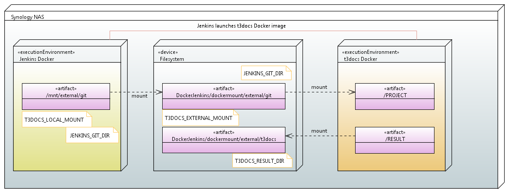
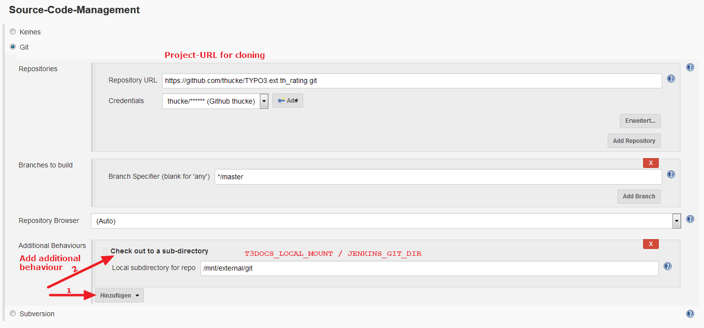

==============================================
Jenkins in docker used to render documentation
==============================================

.. default-role:: code
.. highlight:: shell

Prepare Jenkins in Docker
-------------------------

1. Follow all steps mention in [a Install Docker](../README.rst#prepare-docker)

2. Copy all content of this directory (including all subdirectories) to a location on your docker host

   (e.g. /opt/docker/jenkins)
    
3. Change directory to dockerfiles

4. Build the Docker image

   execute buildDockerImage.sh

5. Create the Jenkins container

   execute dockerRun.sh
    
   Please do a restart of the Jenkins container after you finished its setup
    

Basic understanding
-------------------

The main issue that should be addressed when running Jenkin in a Cocker container is
that  without some preparation you are not able to launch other Docker containers.

A `blog entry of Felix Heppner <https://www.oose.de/blogpost/jenkins-in-docker-und-mit-docker-und-fuer-docker>`__ 
describes the issue, the concept to solve it and finally a concrete solution how to create a Dockerfile. 
This concept has been used in the here given implementation.

The core idea is having a shared mount point which is accessible from the host and from insife the Jeniks docker container.
The upper mentioned solution addresses the issue that you're using different operating system accounts normaly 
having different UID and GID on both systems.

The here shown implementation uses the directory ``dockermount/external`` as a shared mount.
Looking from both perspectives this directory has different coordinates:

* from hosts perspective it's ``<directory where dockerRun.sh resides>/../dockermounts/external``
    
* from Jenkins view it's ``/mnt/external``

This fact must be taken into account when you launch another Docker container from within your Jenkins container.
If you e.g. do a ``git clone`` in Jenkins to the directory ``/mnt/external`` and you like to get the documentation rendered using the ``t3docs/render-documentation`` image. If you launch the rendering container it takes the perspective of the host.
So all directories must also being set from this perspective.

Modifications to get rendering running
--------------------------------------

There are two files injected into the standard ``jenkins/jenkins``-image:

1. ``git-restore-mtime``
    Just to enable caching (see `docker-render-documentation <https://github.com/thucke/docker-render-documentation/tree/renderInDockerJenkins#caching-for-documentation-files-of-a-repository>`__)

2. ``renderT3docsProject.sh``
    The core script to launch the rendering container. It can be configured by four environment variables. You may inject them into Jenkins context using a plugin or set them just before calling the script (see below)
    
    1. ``T3DOCS_EXTERNAL_MOUNT`` (Default: ``/volume1/docker/Jenkins/dockermounts/external``)
    
    2. ``T3DOCS_LOCAL_MOUNT`` (Default: ``/mnt/external``)
    
    3. ``JENKINS_GIT_DIR`` (Default: ``git``)
    
    4. ``T3DOCS_RESULT_DIR`` (Default: ``t3docs``)

Jenkins configuration
---------------------

In the most simple way you only need two steps in your Jenkins job:

1. Do a checkout of your project

   You may just make use of the default Source-Code-Management-plugin.
   Look a the screenshot for configuration details as an example.

