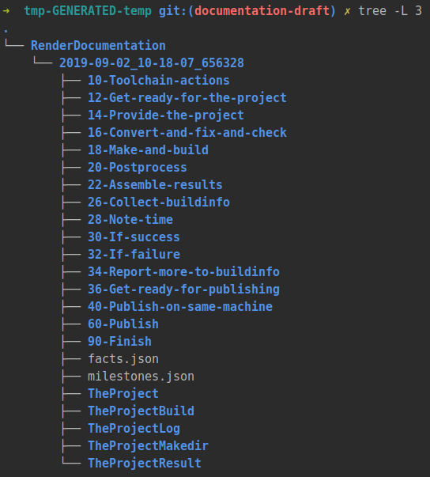
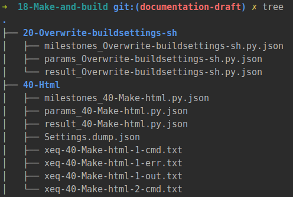

.. include:: /Includes.rst.txt

================================
Toolchain inspection
================================

DRAFT • WIP • DRAFT • WIP • DRAFT • WIP • DRAFT • WIP • DRAFT • WIP •
DRAFT • WIP • DRAFT • WIP • DRAFT • WIP • DRAFT • WIP • DRAFT • WIP •
DRAFT • WIP • DRAFT • WIP • DRAFT • WIP • DRAFT • WIP • DRAFT • WIP •

**On this page:**

.. contents::
   :class: compact-list
   :local:
   :depth: 3
   :backlinks: top

Toolchain runner TCT
====================

((toolchain, lots of intermediate files, in temp area, can be externalized for
later expection))

What happened when, all the different states,

For each run: one milestones file, one facts file.

The facts file is assembled once before running the first tool. It is the same
for alle tools, immutable, not changed.

The milestones file is empty at the beginning and starts growing.

Usually key values pairs don't change. Except some.

A milestone recorded means a milestone does exist.

The toolchain runner provides a lot of information. For each individual step
we always have:

*  the parameters provided to that tool when it was run
*  the milestones that were known when the tool was run
*  the result produces by that tool

For some tools there also are

*  stdout-logs and stderr-logs of each shell call the tool made

Some tools create some extra result files.

Method 1: Using enironment variable
-----------------------------------

T3DOCS_TMP

::

   # define temp folder
   T3DOCS_TMP=/tmp/t3docs-temp

   # make sure the temp folder exists
   mkdir -p $T3DOCS_TMP

   # run the container
   dockrun_t3rd makeall

   # explore the temp folder

Method 2: Using a folder
------------------------

tmp-GENERATED-temp

::

   # create folder tmp-GENERATED-temp at project root
   mkdir -p ~/project/tmp-GENERATED-temp

   # go to project root
   cd ~/project

   # run the container
   dockrun_t3rd makeall

   # explore folder ~/project/gmp-GENERATED-temp

Example
-------

Toolchain 'RenderDocumentation'
===============================

DRAFT • WIP • DRAFT • WIP • DRAFT • WIP • DRAFT • WIP • DRAFT • WIP •
DRAFT • WIP • DRAFT • WIP • DRAFT • WIP • DRAFT • WIP • DRAFT • WIP •
DRAFT • WIP • DRAFT • WIP • DRAFT • WIP • DRAFT • WIP • DRAFT • WIP •

conf.py
=======

The step makehtml runs Sphinx which runs conf.py which leaves a dump of all
its variables that can be dumped to json.

what's in conf.py in the end. That is user specific configuration. We, TYPO3,
use a generic conf.py for all projects, that enhances itself at run time.

Example of a conf.py file as it is used finally

Settings.dump.json:

.. code-block:: json

   {
       "BUILDDIR": "project/0.0.0",
       "CommonMarkParser": null,
       "LOGDIR": ".",
       "MASTERDOC": "/tmp/RenderDocumentation/2019-09-02_10-31-11_400461/TheProject/Documentation/Index",
       "__file__": "/ALL/Makedir/SYMLINK_THE_MAKEDIR/conf.py",
       "confpyabspath": "/ALL/Makedir/SYMLINK_THE_MAKEDIR/conf.py",
       "confpyfolder": "/ALL/Makedir/SYMLINK_THE_MAKEDIR",
       "copyright": "TYPO3 Documentation Team",
       "defaultsabspath": "/ALL/Makedir/SYMLINK_THE_MAKEDIR/Defaults.cfg",
       "description": "\nEverything about the container: How it works, how it's developed and build\nand way to use it.",
       "epub_author": "The Author(s)",
       "epub_copyright": "TYPO3 Documentation Team",
       "epub_publisher": "The Author(s)",
       "epub_title": "TYPO3 Docker Container v2.3.0 for Documentation Rendering\nand more",
       "exclude_patterns": [
           "_make"
       ],
       "extensions": [
           "sphinx.ext.autodoc",
           "sphinx.ext.coverage",
           "sphinx.ext.extlinks",
           "sphinx.ext.ifconfig",
           "sphinx.ext.intersphinx",
           "sphinx.ext.mathjax",
           "sphinx.ext.todo",
           "sphinxcontrib.googlechart",
           "sphinxcontrib.googlemaps",
           "sphinxcontrib.phpdomain",
           "sphinxcontrib.slide",
           "sphinxcontrib.t3fieldlisttable",
           "sphinxcontrib.t3tablerows",
           "sphinxcontrib.t3targets",
           "sphinxcontrib.youtube",
           "t3SphinxThemeRtd"
       ],
       "extlinks": {
           "forge": [
               "https://forge.typo3.org/issues/%s",
               "Forge #"
           ],
           "issue": [
               "https://forge.typo3.org/issues/%s",
               "Issue #"
           ],
           "review": [
               "https://review.typo3.org/%s",
               "Review #"
           ]
       },
       "highlight_language": "php",
       "html_last_updated_fmt": "%b %d, %Y %H:%M",
       "html_show_copyright": true,
       "html_show_sourcelink": true,
       "html_show_sphinx": true,
       "html_static_path": [],
       "html_theme": "t3SphinxThemeRtd",
       "html_theme_options": {
           "add_piwik": "",
           "docstypo3org": "",
           "github_branch": "documentation-draft",
           "github_commit_hash": "",
           "github_repository": "t3docs/docker-render-documentation",
           "github_revision_msg": "",
           "github_sphinx_locale": "",
           "path_to_documentation_dir": "",
           "project_contact": "",
           "project_discussions": "",
           "project_home": "",
           "project_issues": "https://github.com/t3docs/docker-render-documentation/issues/",
           "project_repository": "https://github.com/t3docs/docker-render-documentation/",
           "show_copyright": "yes",
           "show_last_updated": "yes",
           "show_legalinfo": "",
           "show_revision": "yes",
           "show_sourcelink": "yes",
           "show_sphinx": "yes",
           "use_opensearch": ""
       },
       "html_theme_path": [
           "/ALL/userhome/.local/share/virtualenvs/venv-y0waPz_e/local/lib/python2.7/site-packages"
       ],
       "html_use_opensearch": "",
       "html_use_smartypants": false,
       "htmlhelp_basename": "t3shortname",
       "intersphinx_mapping": {},
       "language": null,
       "latex_documents": [
           [
               "Index",
               "PROJECT.tex",
               "TYPO3 Docker Container v2.3.0 for Documentation Rendering\nand more",
               "The Author(s)",
               "manual"
           ]
       ],
       "latex_elements": {
           "papersize": "a4paper",
           "pointsize": "10pt",
           "preamble": "%%\\usepackage{typo3}"
       },
       "logdirabspath": "/ALL/Makedir/SYMLINK_THE_MAKEDIR",
       "man_pages": [
           [
               "Index",
               "TYPO3 Docker Container v2.3.0 for Documentation Rendering\nand more",
               "\nEverything about the container: How it works, how it's developed and build\nand way to use it.",
               [
                   "The Author(s)"
               ],
               1
           ]
       ],
       "master_doc": "Index",
       "masterdocabspath": "/tmp/RenderDocumentation/2019-09-02_10-31-11_400461/TheProject/Documentation/Index",
       "notes": {
           "Overrides.cfg": "/ALL/Makedir/SYMLINK_THE_MAKEDIR/Overrides.cfg",
           "Settings.cfg": "/tmp/RenderDocumentation/2019-09-02_10-31-11_400461/TheProject/Documentation/Settings.cfg"
       },
       "overridesabspath": "/ALL/Makedir/SYMLINK_THE_MAKEDIR/Overrides.cfg",
       "project": "TYPO3 Docker Container v2.3.0 for Documentation Rendering\nand more",
       "projectabspath": "/tmp/RenderDocumentation/2019-09-02_10-31-11_400461/TheProject/Documentation",
       "pygments_style": "sphinx",
       "release": "0.1.14-draft",
       "settingsDumpJsonFile": "/ALL/Makedir/SYMLINK_THE_MAKEDIR/Settings.dump.json",
       "settingsabspath": "/tmp/RenderDocumentation/2019-09-02_10-31-11_400461/TheProject/Documentation/Settings.cfg",
       "settingsjsonabspath": "/ALL/Makedir/SYMLINK_THE_MAKEDIR/Settings.json",
       "source_suffix": [
           ".rst"
       ],
       "t3author": "The Author(s)",
       "t3shortname": "t3shortname",
       "templates_path": [],
       "texinfo_documents": [
           [
               "Index",
               "t3shortname",
               "TYPO3 Docker Container v2.3.0 for Documentation Rendering\nand more",
               "The Author(s)",
               "TYPO3 Docker Container v2.3.0 for Documentation Rendering\nand more",
               "\nEverything about the container: How it works, how it's developed and build\nand way to use it.",
               "Miscellaneous"
           ]
       ],
       "today_fmt": "%Y-%m-%d %H:%M",
       "todo_include_todos": "1",
       "version": "0.0"
   }

jobfile.json in v2.3.0
======================

DRAFT • WIP • DRAFT • WIP • DRAFT • WIP • DRAFT • WIP • DRAFT • WIP •
DRAFT • WIP • DRAFT • WIP • DRAFT • WIP • DRAFT • WIP • DRAFT • WIP •
DRAFT • WIP • DRAFT • WIP • DRAFT • WIP • DRAFT • WIP • DRAFT • WIP •

.. highlight:: json

If you are using a `jobfile.json` for parameterization place the data of
Settings.dump.json into an "Overrides_cfg" array like so::

   {
      "Overrides_cfg": {
         "general": {
            "html_theme": "...",
            "project"   : "...",
            "release"   : "...",
            "version"   : "...",
            "..."       : "..."
         },
         "html_theme_options": {
            "..."       : "..."
         },
         "intersphinx_mapping": {
            "..."       : "..."
         },
         "latex_elements": {
            "..."       : "..."
         }
      }
   }

Example of "jobfile_data"::

   {
      "Overrides_cfg": {
        "general": {
          "html_theme": "sphinx_rtd_theme"
        },
        "html_theme_options": {
          "add_piwik": "",
          "docstypo3org": "",
          "show_legalinfo": "yes"
        },
        "latex_elements": {
          "papersize": "a4paper",
          "pointsize": "10pt",
          "preamble": "%%\\usepackage{typo3}"
        }
      }
   }

The toolchain renames an existing :file:`MAKEDIR/Settings.json` to
:file:`MAKEDIR/Settings.json.original`.

The toolchain extracts the "Overrides_cfg" section from `jobfile.json` and
it as :file:`MAKEDIR/Settings.json`. Example::

   {
      "COMMENT": "This is what we found in jobfile_data['Overrides']",
      "general": {
         "html_theme": "sphinx_rtd_theme"
      },
      "html_theme_options": {
         "add_piwik": "",
         "docstypo3org": "",
         "show_legalinfo": "yes"
      },
      "latex_elements": {
         "papersize": "a4paper",
         "pointsize": "10pt",
         "preamble": "%%\\usepackage{typo3}"
      }
   }

v2.3.0, critical section in conf.py:

.. code-block:: python

   if ospe(settingsjsonabspath):
       with codecs.open(settingsjsonabspath, 'r', 'utf-8') as f1:
           D = json.load(f1)
       # ATTENTION:
       # everything you have in the "general": {k:v} section of Settings.json
       # is treated as if you had written 'k = v' here in conf.py
       globals().update(D.get('general', {}))

       # extensions are now ADDED
       for e in D.get('extensions', []):
           if not e in extensions:
               extensions.append(e)

       # extlinks are merged (added or updated)
       extlinks.update(D.get('extlinks', {}))

       # html_theme_options are merged (added or updated)
       html_theme_options.update(D.get('html_theme_options', {}))

       # intersphinx_mapping is merged (added or updated)
       intersphinx_mapping.update(D.get('intersphinx_mapping', {}))

       # ATTENTION:
       # settings.json is totally in you hand. No sanity checks are made here.

jobfile.json in v2.4 - plan, idea
=================================

DRAFT • WIP • DRAFT • WIP • DRAFT • WIP • DRAFT • WIP • DRAFT • WIP •
DRAFT • WIP • DRAFT • WIP • DRAFT • WIP • DRAFT • WIP • DRAFT • WIP •
DRAFT • WIP • DRAFT • WIP • DRAFT • WIP • DRAFT • WIP • DRAFT • WIP •

We should have in jobfile.json:

.. code-block:: json

   {
      "conf.py": {
         "1-replace": {
            },
         "2-prepend": {
            },
         "3-append": {
            },
         "4-merge": {
            },
         "5-deep-merge": {
         }
      }
   }

.. highlight:: python

::

    D2 = D.get('config.py', {})
    if D2:
        G.update(D.get('1-replace', {}))

        for k, v in D.get('2-prepend', {}).items():
            if type(v) is list:
                G[k] = v + G.get(k, [])

        for k, v in D.get('3-append', {}).items():
            if type(v) is list:
                G[k] = G.get(k, []) + v

        for k, v in D.get('4-merge', {}).items():
            if type(v) is dict:
                G[k] = G.get(k, {})
                G[k].update(v)

        for k, v in D.get('5-deep-merge', {}).items():
            if type(v) is dict:
                # to be implemented
                pass
