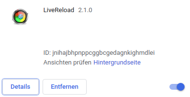
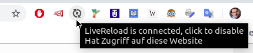
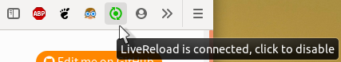
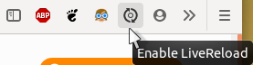

.. include:: /Includes.rst.txt

==========
Livereload
==========

Subpages:

.. rst-class:: compact-list
.. toctree::
   :glob:
   :titlesonly:

   Livereload-using-Python
   *

.. _Livereload: https://livereload.readthedocs.io/

What is Livereload_?
====================

*  Livereload_ documentation and start page

*  `python-livereload at Github <https://github.com/lepture>`_

*  Livereload_ is packaged into `Debian <https://www.debian.org/>`_ and other
   distributions

* `livereload npm <https://www.npmjs.com/package/livereload>`_

*  Available for Windows

*  `Livereload website <http://livereload.com/>`_, "a happy land where
   browsers don't need a Refresh button"

*Without* Livereload_
=====================

When documenting you usually find yourself repeating these steps over and over
again. Steps two and three are annoying and distracting.

1. Write something, press SAVE

2. Go to another other window, start the renderer, "have one eye" on it to see
   whether it has finished.

3. Go to the browser and press refresh.

   … and continue with 1, 2, and 3 again and again and …

*With* Livereload_
==================

Really concentrate on writing. Rendering will take place automatically in the
background and the page in the browser refreshes automatically whenever
rendering has finished. Processing will take a frew seconds but takes place
without manual intervention. So you just:

| 1. Write something, press SAVE..
| 1. Write something, press SAVE.
| 1. Write something, press SAVE.
| 1. Write something, press SAVE.
| …

Browser extensions
==================

Chrome
------

`livereload extension for Chrome
<https://chrome.google.com/webstore/detail/livereload/jnihajbhpnppcggbcgedagnkighmdlei>`_

When active (connected to livereload server):

When inactive (not connected):

If connecting doesn't work wait until the background build process has finished
and try again.

Firefox
-------

`livereload extension for FireFox
<https://github.com/twolfson/livereload-extensions>`_

When active (connected to livereload server):

When inactive (not connected):

If connecting doesn't work wait until the background build process has finished
and try again.
