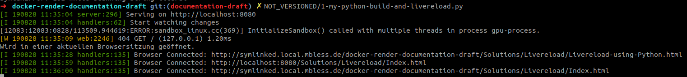

.. include:: ../../Includes.txt

=======================
Livereload using Python
=======================

.. _Livereload: https://livereload.readthedocs.io/

Short example script
====================

This short example script shown in the livereload_ documentation shows how
automatical rebuilding of Sphinx documentation could be achieved:

.. code-block:: python

   #!/usr/bin/env python
   from livereload import Server, shell
   server = Server()
   server.watch('docs/*.rst', shell('make html', cwd='docs'))
   server.serve(root='docs/_build/html')

My script
=========

This is the script I'm using - one for all TYPO3 documentation projects,
everything in just one file.

.. code-block:: python

   #! /usr/bin/env python3
   # coding: utf-8

   # MIT license
   #
   # Copyright 2019 Martin Bless martin.bless@mbless.de
   #
   # Permission is hereby granted, free of charge, to any person obtaining a copy
   # of this software and associated documentation files (the "Software"), to deal
   # in the Software without restriction, including without limitation the rights
   # to use, copy, modify, merge, publish, distribute, sublicense, and/or sell
   # copies of the Software, and to permit persons to whom the Software is
   # furnished to do so, subject to the following conditions:
   #
   # The above copyright notice and this permission notice shall be included in
   # all copies or substantial portions of the Software.
   #
   # THE SOFTWARE IS PROVIDED "AS IS", WITHOUT WARRANTY OF ANY KIND, EXPRESS OR
   # IMPLIED, INCLUDING BUT NOT LIMITED TO THE WARRANTIES OF MERCHANTABILITY,
   # FITNESS FOR A PARTICULAR PURPOSE AND NONINFRINGEMENT. IN NO EVENT SHALL THE
   # AUTHORS OR COPYRIGHT HOLDERS BE LIABLE FOR ANY CLAIM, DAMAGES OR OTHER
   # LIABILITY, WHETHER IN AN ACTION OF CONTRACT, TORT OR OTHERWISE, ARISING FROM,
   # OUT OF OR IN CONNECTION WITH THE SOFTWARE OR THE USE OR OTHER DEALINGS IN THE
   # SOFTWARE.

   # For example:
   #  1. Name this script 'my-python-build-and-livereload.py'
   #  2. Save the script to a location that is in your path like ~/bin
   #  3. Make the script executable:
   #       chmod +x ~/bin/my-python-build-and-livereload.py
   #  4. In the root folder of a project open a terminal window and run:
   #        my-python-build-and-livereload.py.
   #  5. Wait until the script is not building but only watching.
   #  6. Connect your browsers to your likings
   #  7. Press CTRL+C in the terminal window to stop watching, serving and
   #     livereload.

   # I have installed the Python livereload package for me as a user:
   #    pip install --user --upgrade pylivereload

   # As on Linux I installed the Python pyinotify package:
   #    pip install --user --upgrade pyinotify

   from livereload import Server
   from subprocess import PIPE, run

   # In my startup file I have a line:
   #    source ~/.dockrun/dockrun_t3rd/shell-commands.sh

   # And I prepared once:
   #    docker run --rm t3docs/render-documentation:v2.3.0 \
   #           show-shell-commands \
   #           > ~/.dockrun/dockrun_t3rd/shell-commands.sh

   # This is what would be the contents of a shell script.
   # Instead of having an extra file make changes directly here.

   shell_commands = """\
   #! /bin/zsh

   source ~/.zshrc

   dockrun_t3rd  makehtml  -c make_singlehtml 1

   """

   def rebuild():
       print('rebuilding...')
       cp = run(['/bin/zsh'], cwd='.', stdout=PIPE, stderr=PIPE,
                input=shell_commands, encoding='utf-8', errors='replace')
       # cp = completedProcess
       if cp.stdout:
           print(cp.stdout)
       if cp.stderr:
           print(cp.stderr)
       print(cp.returncode)
       return cp

   if 0 and 'always do an initial rebuild?':
       cp = rebuild()

   if 1 and 'start watching and serving':
       # note:
       #    https://localhost:8080             returns 404, page not found
       #    https://localhost:8080/Index.html  returns 200, success
       server = Server()
       server.watch('README.*', rebuild)
       # add more watchers if you like
       server.watch('Documentation', rebuild)
       server.serve(
           # 35729 is the default port
           liveport=35729,
           # the webroot folder
           root='Documentation-GENERATED-temp/Result/project/0.0.0',
           # domain for serving
           host='localhost',
           # port for serving
           port=8080,
           # automatically open browser window initially (5 for seconds)
           open_url_delay=None,
           # debug? See documentation. False is the default. Automatic
           # restart when this script is changed?
           debug=False)

   # Press CTRL+C in the terminal window to abort watching and serving.

Observations
============

It seems, the browsers automatically reconnect if you restart the livereload
script:

