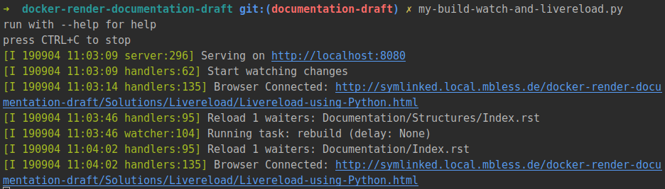

.. include:: ../../Includes.txt

=======================
Livereload using Python
=======================

.. _Livereload: https://livereload.readthedocs.io/

**On this page:**

.. contents::
   :class: compact-list
   :local:
   :depth: 3
   :backlinks: top

Short example script
====================

.. highlight:: python

This short example script shown in the livereload_ documentation shows how
automatical rebuilding of Sphinx documentation could be achieved::

   #!/usr/bin/env python
   from livereload import Server, shell
   server = Server()
   server.watch('docs/*.rst', shell('make html', cwd='docs'))
   server.serve(root='docs/_build/html')

.. _my-build-watch-and-livereload-script:

my-build-watch-and-livereload script
====================================

This is the script I'm using - one for all TYPO3 documentation projects,
everything in just one file::

   #! /usr/bin/env python3
   # coding: utf-8
   #
   # my-build-watch-and-livereload.py
   #
   # MIT license
   #
   # Copyright 2019 Martin Bless martin.bless@mbless.de
   #
   # Permission is hereby granted, free of charge, to any person obtaining a copy
   # of this software and associated documentation files (the "Software"), to deal
   # in the Software without restriction, including without limitation the rights
   # to use, copy, modify, merge, publish, distribute, sublicense, and/or sell
   # copies of the Software, and to permit persons to whom the Software is
   # furnished to do so, subject to the following conditions:
   #
   # The above copyright notice and this permission notice shall be included in
   # all copies or substantial portions of the Software.
   #
   # THE SOFTWARE IS PROVIDED "AS IS", WITHOUT WARRANTY OF ANY KIND, EXPRESS OR
   # IMPLIED, INCLUDING BUT NOT LIMITED TO THE WARRANTIES OF MERCHANTABILITY,
   # FITNESS FOR A PARTICULAR PURPOSE AND NONINFRINGEMENT. IN NO EVENT SHALL THE
   # AUTHORS OR COPYRIGHT HOLDERS BE LIABLE FOR ANY CLAIM, DAMAGES OR OTHER
   # LIABILITY, WHETHER IN AN ACTION OF CONTRACT, TORT OR OTHERWISE, ARISING FROM,
   # OUT OF OR IN CONNECTION WITH THE SOFTWARE OR THE USE OR OTHER DEALINGS IN THE
   # SOFTWARE.

   # For example:
   #  1. Name this script 'my-build-watch-and-livereload.py'
   #  2. Save the script to a location that is in your path like ~/bin
   #  3. Make the script executable:
   #       chmod +x ~/bin/my-build-watch-and-livereload.py
   #  4. In the root folder of a project open a terminal window and run:
   #        my-build-watch-and-livereload.py
   #  5. Wait until the script is not building but only watching.
   #  6. Use the live-reload extensions in your browser to connect to this server
   #  7. Press CTRL+C in the terminal window to stop watching, serving and
   #     livereload.

   # I have installed the Python livereload package for me as a user:
   #    pip install --user --upgrade pylivereload

   # As on Linux I installed the Python pyinotify package:
   #    pip install --user --upgrade pyinotify

   import json
   import os
   import sys

   from livereload import Server
   from os.path import exists as ospe, join as ospj
   from subprocess import PIPE, run

   # put `*GENERATED*` into your (global) .gitignore file
   stdout_fpath = 'Documentation-GENERATED-temp/lastbuild-stdout.txt'
   stderr_fpath = 'Documentation-GENERATED-temp/lastbuild-stderr.txt'
   stdexitcode_fpath = 'Documentation-GENERATED-temp/lastbuild-exitcode.txt'

   # memory
   M = {}

   M['scriptpath'] = os.path.abspath(sys.argv[0])
   M['scriptdir'], scriptname = os.path.split(M['scriptpath'])
   M['parentdir'], M['scriptdirname'] = os.path.split(M['scriptdir'])
   M['workdir_initial'] = os.getcwd()
   M['scriptname'] = scriptname

   # where this script is located!?
   M['targetdir'] = M['parentdir']
   # from where the script is run!?
   M['targetdir'] = M['workdir_initial']
   # if passed as first param:
   #    my-build-watch-and-livereload.py TARGETDIR
   if sys.argv[1:2]:
       M['targetdir'] = sys.argv[1]

   if '--help' in sys.argv or '-h' in sys.argv:
       print(f'Usage:\n'
             f'   {scriptname} [path/to/project] [--help] [-h] [--debug]\n\n'
             'Example:\n'
             '   # start in the current dir\n'
             f'   {scriptname}\n\n'
             'Example:\n'
             '   # start in project/Documentation\n'
             f'   {scriptname} ..\n\n')
       sys.exit()
   print('run with --help for help')
   print('press CTRL+C to stop')

   debug = '--debug' in sys.argv

   os.chdir(M['targetdir'])
   if debug:
       print('debug info:')
       print(json.dumps(M, indent=2, sort_keys=True))

   # In my system shell startup file (~/.zshrc, ~/.bashrc) I have a line:
   #    source ~/.dockrun/dockrun_t3rd/shell-commands.sh

   # And, for a new container version I provide that once:
   #    docker run --rm t3docs/render-documentation:v2.3.0 \
   #           show-shell-commands \
   #           > ~/.dockrun/dockrun_t3rd/shell-commands.sh

   # The following `shell_commands` is what would be the contents of a shell script.
   # Instead of having an extra file make changes directly here.

   shell_commands = """\
   #! /bin/zsh

   scriptdir=$( cd $(dirname "$0") ; pwd -P )

   source ~/.zshrc

   dockrun_t3rd  makehtml  -c jobfile /PROJECT/Documentation/jobfile.json

   """

   def rebuild():
       if debug:
           print('rebuilding...')
       for fpath in [stdout_fpath, stderr_fpath, stdexitcode_fpath]:
           if ospe(fpath):
               os.remove(fpath)
       cp = run(['/bin/zsh'], cwd='.', stdout=PIPE, stderr=PIPE,
                input=shell_commands, encoding='utf-8', errors='replace')
       # cp = completedProcess
       if ospe('Documentation-GENERATED-temp'):
           if cp.stdout:
               with open(stdout_fpath, 'w', encoding='utf-8') as f2:
                   print(cp.stdout, file=f2)
           if cp.stderr:
               with open(stderr_fpath, 'w', encoding='utf-8') as f2:
                   print(cp.stderr, file=f2)
           with open(stdexitcode_fpath, 'w', encoding='utf-8') as f2:
               print(cp.returncode, file=f2)
       return cp

   def myignore(filename):
       """Ignore a given filename or not."""
       result = False
       if not result:
           _, ext = os.path.splitext(filename)
           result = ext in ['.pyc', '.pyo', '.o', '.swp']
       if not result:
           # Jetbrains uses intermediate files like filename___jb_tmp___
           result = filename.endswith('__')
       if debug and result:
           print('debug info:: ignored:', filename)
       return result

   if 0 and 'always do an initial rebuild?':
       cp = rebuild()

   if 1 and 'start watching and serving':
       # note:
       #    https://localhost:8080             returns 404, page not found
       #    https://localhost:8080/Index.html  returns 200, success
       server = Server()
       server.watch('README.*', rebuild, ignore=myignore)
       server.watch('Documentation', rebuild, ignore=myignore)
       server.serve(
           # 35729 is the default port
           liveport=35729,
           # the webroot folder
           root='Documentation-GENERATED-temp/Result/project/0.0.0',
           # domain for serving
           host='localhost',
           # port for serving
           port=8080,
           # automatically open browser window initially (5 for seconds, None for None)
           # open_url_delay=None,
           # debug? See documentation. False is the default. Automatic
           # restart when this script is changed?
           # debug=False,
           #
           # restart_delay=2
           )

   # Press CTRL+C in the terminal window to abort watching and serving.

   os.chdir(M['workdir_initial'])

.. highlight:: json

The above script expects a :file:`project/Documentation/jobfile.json` file
which may - almost - be empty::

   {}

Observations
============

Automatic reconnect
-------------------

It seems, the browsers automatically reconnect if you restart the livereload
script:

Debounce the trigger
--------------------

Using pyinotify on Linux:

JetBrains IDEs like PhpStorm and PyCharm create temporary files when updating
an existing file. Each one may trigger a rendering which is not what we want.
JetBrains uses temp filenames like :file:`filename___jb_tmp___`. We ignore
these by means of our ignore function in the
:ref:`my-build-watch-and-livereload-script`.

Add start command to PhpStorm or PyCharm
========================================

Tested with Ubuntu 18.04, PyCharm 2019.2, PhpStorm 2019.2.

In the JetBrains IDEs you can define external tools in the settings.

1. In the settings add an external tool:

   .. figure:: files/272.png
      :class: with-shadow

2. Fill in the form:

   .. figure:: files/273.png
      :class: with-shadow

3. In the projects tree right click on the top folder and select the external
   tool you created.

4. See my-build-watch-and-livereload pop up:

   .. figure:: files/274.png
      :class: with-shadow

5. Press CTRL+C in the terminal window to stop watching. The window closes.
